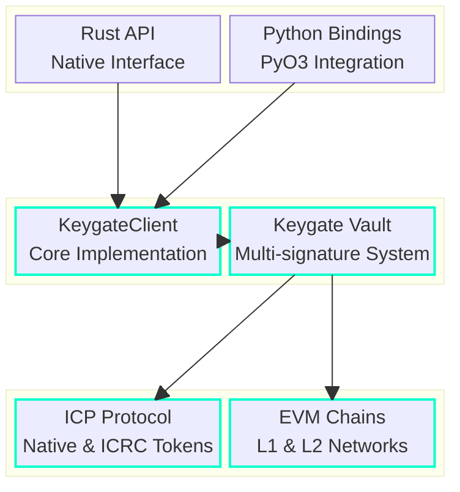

[](https://internetcomputer.org)
[](LICENSE)

# sdk

A Rust SDK for Keygate, allowing developers to create their own multisignature infrastructure on-chain or off-chain.

## Architecture



## Quick Start

Add to your `Cargo.toml`:
```toml
[dependencies]
keygate-sdk = "0.1.0"
```

### Examples

```rust
use keygate_sdk::{KeygateClient, load_identity};

#[tokio::main]
async fn main() {
    // Initialize client
    let identity = load_identity("path/to/identity.pem").await?;
    let client = KeygateClient::new(identity, "https://your-keygate-url").await?;

    // Create a wallet
    let wallet_id = client.create_wallet().await?;
    
    // Execute a transaction
    let transaction = TransactionArgs {
        to: "recipient_account_id".to_string(),
        amount: 1.5, // Amount in ICP
    };
    
    let status = client
        .execute_transaction(&wallet_id.to_string(), &transaction)
        .await?;
}
```

## Development Setup

### Prerequisites

- Rust 1.54+
- Cargo
- ICP identity
- Keygate access
 
### Build and Test

```bash
# Build the SDK
cargo build --release

# Run tests
cargo test

# Build Python wheels
cargo build --features python-bindings
```

## Contributing

We welcome contributions! Please see our [Contributing Guidelines](CONTRIBUTING.md) for details.

## License

This project is licensed under the MIT License - see the [LICENSE](LICENSE) file for details.


<div align="center">
  
**[Website](https://keygate.io)** | **[Documentation](https://docs.keygate.io)** | **[Examples](./examples)**

</div>
